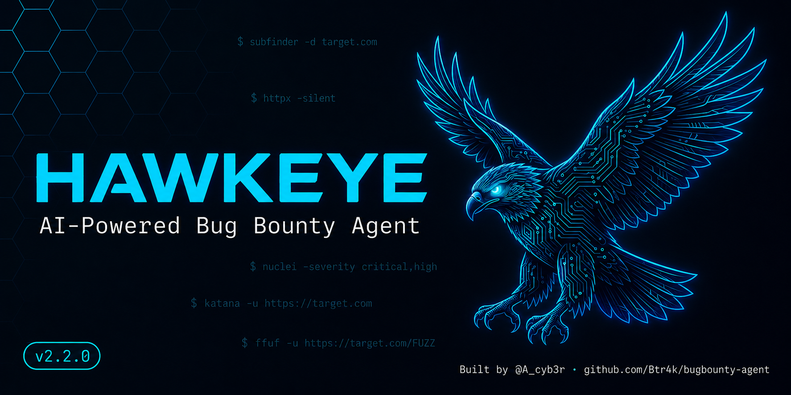

<p align="center">
  
</p>

<p align="center">
  <a href="https://github.com/Btr4k/bugbounty-agent/releases"></a>
  <a href="https://github.com/Btr4k/bugbounty-agent/actions/workflows/ci.yml"></a>
  
  
  <a href="LICENSE"></a>
  
</p>

<p align="center">
  <b>Recon → Scan → AI Validation → Report</b><br/>
  One command. Scoped attack surface. High-signal findings.
</p>

---

## What is HawkEye?

HawkEye is a full-pipeline bug bounty automation agent written in Go.  
It chains recon tools, vulnerability scanners, and an AI validator into a single workflow —  
producing a scoped report that contains only grounded, AI-reviewed findings.

```
./hawkeye -d hackerone-target.com
```

That's it. HawkEye handles the rest.

---

## Pipeline

```
  ┌──────────────────────────────────────────────────────────────────┐
  │                         TARGET DOMAIN                            │
  └─────────────────────────────┬────────────────────────────────────┘
                                │
                                ▼
  ┌─────────────────────────────────────────────────────────────────┐
  │  PHASE 1 — RECON                                                │
  │                                                                 │
  │  subfinder · assetfinder · crt.sh · C99.nl · waybackurls       │
  │  katana                                                         │
  │                                                                 │
  │  → subdomains · live URLs · JS files · parameters              │
  └─────────────────────────────┬───────────────────────────────────┘
                                │
                                ▼
  ┌─────────────────────────────────────────────────────────────────┐
  │  PHASE 2 — SCANNING (parallel)                                  │
  │                                                                 │
  │  httpx         → live host detection + status codes            │
  │  nuclei        → CVEs · misconfigs · exposures · takeovers     │
  │  ffuf          → verified sensitive-file exposure              │
  │  dalfox        → reflected XSS with PoC                        │
  │  arjun         → feeds undocumented params into Dalfox         │
  │  nmap          → opt-in reconnaissance only                    │
  │  SQLi scanner  → injection via parameter analysis              │
  └─────────────────────────────┬───────────────────────────────────┘
                                │
                                ▼
  ┌─────────────────────────────────────────────────────────────────┐
  │  PHASE 2.5 — JS ANALYSIS                                        │
  │                                                                 │
  │  Regex engine  → high-confidence credentials and tokens        │
  │  AI (LLM)      → deep analysis of app bundles (12KB/file)      │
  │                                                                 │
  │  Detects: AWS/GitHub/Stripe keys · JWT tokens                  │
  │           hardcoded passwords · database credentials           │
  └─────────────────────────────┬───────────────────────────────────┘
                                │
                                ▼
  ┌─────────────────────────────────────────────────────────────────┐
  │  PHASE 3 — VALIDATION PIPELINE                                  │
  │                                                                 │
  │  Every finding passes deterministic checks and AI review:      │
  │  · Rejects unsupported and likely false-positive results       │
  │  · Assigns CVSS-informed severity                              │
  │  · Preserves tool-captured reproduction commands               │
  │  · Writes impact assessment + remediation                      │
  └─────────────────────────────┬───────────────────────────────────┘
                                │
                                ▼
  ┌─────────────────────────────────────────────────────────────────┐
  │  PHASE 4 — REPORT                                               │
  │                                                                 │
  │  Markdown report with:                                         │
  │  · Executive summary · Risk score · Severity breakdown         │
  │  · Validation-pipeline findings only · Captured evidence       │
  └─────────────────────────────────────────────────────────────────┘
```

---

## Modules

| Module | Engine | Finds |
|---|---|---|
| Subdomain Recon | subfinder · assetfinder · crt.sh · C99 | Subdomains |
| URL Discovery | waybackurls · katana | Endpoints, parameters, JS files |
| Live Detection | httpx | Live hosts used by downstream scanners |
| Vulnerability Scan | nuclei (high-value templates) | CVEs, misconfigs, exposures, takeovers |
| Sensitive File Validation | ffuf + built-in verifier | Accessible files with matching sensitive content |
| Vhost Discovery (opt-in) | ffuf (Host header) | Recon observations only |
| XSS | dalfox | Reflected XSS with PoC |
| SQLi | nuclei + param filter | SQL injection vectors |
| Hidden Params | arjun | Feeds discovered parameters into Dalfox; not reported as vulnerabilities |
| Port Scan (opt-in) | nmap | Recon observations only |
| JS Analysis | Regex + grounded LLM output | Credentials, keys, and tokens |
| Validation Pipeline | Deterministic rules + DeepSeek / Claude / GPT-4 | False-positive filtering + evidence review |

---

## Quick Start

```bash
# 1. Clone
git clone https://github.com/Btr4k/bugbounty-agent.git
cd bugbounty-agent

# 2. Install all dependencies
chmod +x install.sh && ./install.sh

# 3. Set one AI key (the provider is auto-detected)
cp .env.example .env
# Edit .env and replace one placeholder with a real key

# 4. Build
go build -o hawkeye ./cmd/main.go

# 5. Scan
./hawkeye -d target.com
```

---

## Usage

```
./hawkeye [flags]

Required (either flag works):
  -d, --domain      string   Target domain (e.g. example.com)
  -t, --target      string   Target domain (alias for -d/--domain)

Options:
  -v, --verbose              Show detailed scan progress
  -c, --config     string    Config file path (default: config.yaml)
  -o, --output     string    Report output directory (default: ./reports)
      --skip-recon           Skip recon phase (subdomains already known)
      --skip-scan            Skip vulnerability scanning phase
      --js-only              Run JS analysis only (skips vulnerability scanning)
      --ai-provider string   Override AI provider: claude | deepseek | openai | openrouter | custom
      --ai-model    string   Override AI model name
      --version              Show HawkEye version
  -h, --help                 Show help
```

### Examples

```bash
# Standard full scan
./hawkeye -d target.com

# Full scan with live progress output
./hawkeye -d target.com --verbose

# JS credential and token analysis only (fast, no vulnerability scanning)
./hawkeye -d target.com --js-only

# Skip subdomain enumeration
./hawkeye -d target.com --skip-recon

# Skip scanning, run AI analysis on recon output only
./hawkeye -d target.com --skip-scan

# Use a specific AI provider for this run
./hawkeye -d target.com --ai-provider claude --ai-model claude-sonnet-4-20250514

# Use short flags
./hawkeye -t target.com -v
```

---

## Installation

### System Requirements

- **OS**: Linux (Ubuntu 20.04+, Debian 11+, Kali, Parrot)
- **Go**: 1.25 or later
- **RAM**: 512MB minimum, 2GB recommended for large targets

### Automatic (recommended)

```bash
chmod +x install.sh && ./install.sh
```

The installer handles Go tools, system packages, and nuclei templates.

### Manual

```bash
# Core Go tools
go install github.com/projectdiscovery/subfinder/v2/cmd/subfinder@latest
go install github.com/projectdiscovery/httpx/cmd/httpx@latest
go install github.com/projectdiscovery/nuclei/v3/cmd/nuclei@latest
go install github.com/projectdiscovery/katana/cmd/katana@latest
go install github.com/tomnomnom/assetfinder@latest
go install github.com/tomnomnom/waybackurls@latest
go install github.com/ffuf/ffuf/v2@latest
go install github.com/hahwul/dalfox/v2@latest

# System tools
sudo apt install -y nmap

# Optional — hidden parameter discovery
pip3 install arjun

# Wordlist for ffuf (strongly recommended)
sudo apt install seclists

# Nuclei templates
nuclei -update-templates

# Build HawkEye
go build -o hawkeye ./cmd/main.go
```

---

## Configuration

### AI Provider

Copy `.env.example` to `.env`, then set exactly one provider key. HawkEye
auto-detects the provider in this priority order: Claude, DeepSeek, OpenAI,
then OpenRouter. System environment variables take precedence over `.env`.

| Provider | Environment Variable | Default Model |
|---|---|---|
| Claude | `ANTHROPIC_API_KEY` | `claude-sonnet-4-20250514` |
| DeepSeek | `DEEPSEEK_API_KEY` | `deepseek-chat` |
| OpenAI | `OPENAI_API_KEY` | `gpt-4o-mini` |
| OpenRouter | `OPENROUTER_API_KEY` | `deepseek/deepseek-chat` |

To select a provider explicitly, edit `config.yaml`:

```yaml
ai:
  provider: "deepseek"            # deepseek | claude | openai | openrouter | custom
  api_key: "${DEEPSEEK_API_KEY}"  # loaded from .env automatically
  model: "deepseek-chat"
  max_tokens: 2000
```

For an OpenAI-compatible custom endpoint, both `model` and `base_url` are
required:

```yaml
ai:
  provider: "custom"
  api_key: "${AI_API_KEY}"
  model: "your-model"
  base_url: "https://your-endpoint.example/v1"
```

### Scope and Rate Limits

The domain supplied with `--domain` or `--target` becomes the authorized root
scope. HawkEye permits that domain and its subdomains, rejects discovered
out-of-scope hosts, and filters IP addresses out of active scanning.

Use `excluded_subdomains` for assets that the program explicitly excludes, and
set `rate_limit` to match the program's rules:

```yaml
target:
  excluded_subdomains:
    - "production.example.com"
    - "*.third-party.example.com"

scanning:
  rate_limit: 25
```

Always review the target program's written scope before starting a scan.

### Safety and Limitations

- Automated and AI-reviewed findings still require manual verification before
  submission.
- A partial scan or failed external tool is reported as incomplete; it does not
  mean the target is secure.
- Active scanners can generate substantial traffic. Set `rate_limit`, disable
  prohibited modules, and follow the program's rules.

### C99.nl API (Subdomain Intelligence)

C99.nl significantly improves subdomain discovery. Without it, HawkEye still works but misses subdomains that only C99's database covers.

**Get a key:** Register at [c99.nl](https://c99.nl) → Dashboard → API Key

Add it to `.env`:

```env
C99_API_KEY=your-api-key-here
```

It is automatically picked up via `config.yaml`:

```yaml
c99:
  api_key: "${C99_API_KEY}"
  enabled: true
```

To disable C99 without removing the key:

```yaml
c99:
  enabled: false
```

---

### Wordlist (ffuf)

For maximum path discovery coverage, install SecLists:

```bash
sudo apt install seclists
# Auto-detected at: /usr/share/seclists/Discovery/Web-Content/common.txt
```

Or specify a custom path in `config.yaml`:

```yaml
scanning:
  tools:
    ffuf:
      wordlist_path: "/path/to/your/wordlist.txt"
```

Without SecLists, HawkEye falls back to a built-in list of ~130 high-value paths  
(.env, .git, admin panels, Spring actuators, swagger, etc.) — functional but limited coverage.

### Blind XSS

```yaml
scanning:
  tools:
    dalfox:
      blind_url: "https://your-burp-collaborator.com"
```

---

## Output

Reports are saved to `./reports/` in Markdown:

```
reports/
└── bug_bounty_report_2026-04-04_16-41-25.md
```

### Report Structure

```
Executive Summary
  └── Risk score · Finding counts · Subdomains discovered

Critical Findings
  └── Title · URL · Captured Evidence · Analysis · Tool Command

High / Medium / Low Findings
  └── Same structure

Subdomain List
  └── All discovered subdomains
```

---

## Troubleshooting

### Enabled tools are missing

HawkEye checks every enabled external tool before scanning and exits with the
installation command for anything missing. Run `./install.sh`, or disable the
unused tool in `config.yaml`.

### AI API key is required

Copy `.env.example` to `.env`, replace one AI-provider placeholder with a real
key, and run HawkEye from the repository directory. Do not commit `.env`;
it is intentionally ignored by Git.

### Develop and Test

```bash
# Run the test suite
go test ./...

# Run static analysis
go vet ./...

# Build the CLI
go build -trimpath -o hawkeye ./cmd/main.go
```

See [CHANGELOG.md](CHANGELOG.md) for release changes and
[SECURITY.md](SECURITY.md) for private vulnerability reporting.

---

## Legal

> **HawkEye is for authorized security testing only.**  
> Only use this tool against systems you own or have **explicit written permission** to test.  
> Unauthorized scanning is illegal in most jurisdictions.  
> See [SECURITY.md](SECURITY.md) for the full responsible disclosure policy.

---

<p align="center">
  Built by <a href="https://x.com/A_cyb3r">@A_cyb3r</a> &nbsp;·&nbsp; MIT License &nbsp;·&nbsp; v2.2.0
</p>
